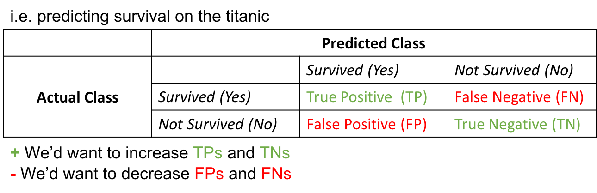
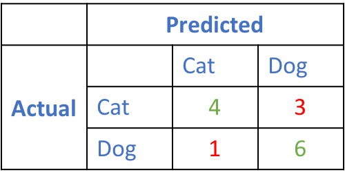
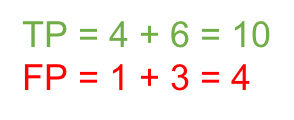
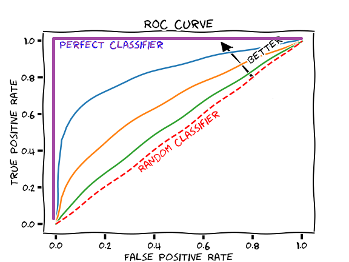

**TL;DR:** In applied machine learning, models are often optimised for their accuracy in predicting a target. When the target is quantitative, measures like the R^2 value and the Root Mean Squared Error (RMSE) etc., help in quantifying this accuracy. When the target is qualitative, metrics like Accuracy, Precision, Recall and several others are used. We term these measures 'classification metrics' for the sake of this blog post.

In this post, I explain classification metrics and provide python code to calculate them. I also produce a report including them that can be easily saved to a file for later use. 

Say you've run your data through a classifier, and the classifier has predicted labels for your data. To judge how accurate those predictions are, you can evaluate them by the metrics explained below

### Section 1: Classification Metrics

The metrics covered by this post is as follows:

* **Accuracy** - What proportion of sentences were correctly classified (i.e. as positive, negative, neutral)?
* **Precision** - Answers the q: What proportion of _predicted_ positives were actual positives? The polar opposite for this is specificity:
  * **Specificity** - Answers the q: What proportion of _predicted_ negatives were actual negatives?
* **Recall/Sensitivity** - Answers the q: What proportion of _actual_ positives were predicted positive?
* **F-1 Score** - The harmonic mean of a classifier's precision and recall scores

Generally, when someone mentions the last 3 metrics above, without a prefix, they mean them to be the _macro-precision_, _macro-recall_, and _macro-F1_. These metrics come in two other flavours however, the micro- and the weighted. Let's take the example of the precision score (but the exact same descriptions can be said for recall and the F-1 score). Whilst the macro precision is simply the average of the precision scores calculated for each class, the weighted precision weights this score by the number of examples of that class before averaging across classes. This is why macro precision is a better metric for balanced data-sets while weighted precision is better for imbalanced ones. Micro precision is more involved than both, and is explained later on. 

The above metrics can be calculated from a **confusion matrix** which is a 2D matrix showing the predicted and actual counts of a target category, therefore showing the distribution of True Positives (TPs), False Positives (FPs), True Negatives (TNs), and False Negatives (FNs) in your data.

As we see in Section 1.1 below, the equations of the above metrics require knowledge of the TP/FPs and TN/FNs. Calculating the above metrics by hand therefore requires a confusion matrix to be made beforehand.

#### Section 1.1: Diving Deeper into the Metrics

Let's display a confusion matrix for a binary classification (i.e. 2 classes for the target) problem to intuitively get a grasp of its contents.



The goal for a classifier is to increase TP/TNs while reducing misclassification, or the number of FP/FNs 

Knowing the above, our metrics can be represented as the following equations: 
$$
Accuracy = \frac{TP + TN}{FP + FN + TP + TN}
$$

$$
Precision = \frac{TP}{TP + FP}
$$

$$
Recall = \frac{TP}{TP + FN}
$$

$$
F_1= \frac{2}{\frac{1}{Precision} \times \frac{1}{Recall}} = 2 \times \frac{Recall \times Precision}{Recall + Precision}
$$

#### Section 1.2: Diving Deeper into various flavours of Precision

Shown above is the equation for the precision score of **one class**. 

The macro and weighted precision scores for a binary classification (i.e. with 2 classes) can be represented as:

$$
Macro Precision= \frac{Precision_{class1} + Precision_{class2}}{2}
$$

$$
Weighted Precision= \frac{(Precision_{class1} \times c_1) + (Precision_{class2} \times c_2)}{c_1 + c_2}
$$

where $c_1$ and $c_2$ are the number of examples in classes $1$ and $2$

Note that if we replace ```Precision``` above with ```F-1 score``` or ```Recall```, the formulas would still work!

To calculate micro precision, instead of taking measurements of precision **for each class** (i.e. taking TPs and FPs for each class), we compute TPs and FPs out of the **total pool** of examples.

Take the confusion matrix below for another binary classification problem, classifying photos of a cat or a dog.


We calculate the TP and FP out of the total number of examples as follows:


And therefore our micro precision is:


#### Section 1.3: The ROC/AUC scores
In a later blog post, we'll explore two additional metrics briefly described below, as they are derived simultaneously while training a machine learning model.

* **ROC curve** - Shows how changing the [classification threshold](https://developers.google.com/machine-learning/crash-course/classification/thresholding) changes the True Positive Rate and False Positive Rate. In a binary classification problem, the classification threshold is a probability value that delineates between two classes, and is a hyperparameter we have to optimise for. Why is it a probability value? Well that's because classifiers return probability values before we associate a category to those values based on our interpretation of them! Say, for one image classified by our Dog vs. Cat image classifier above, the resulting probabilities are 0.95 that it's a dog and 0.05 that it's a cat. The image is **likely** a dog...but what if we had a second image where the probability of it being a dog was 0.6? The **classification threshold** we set determines what class this second image belongs to, and if we set it to be 0.6, then our image _just barely made it to the threshold of being a dog image_. Probabilities below 0.6 will classify it as a cat. You can see how changing this threshold might change the number of TPs/FPs and TNs/FNs in our data. See the image below for a visual depiction of this curve.
* **AUC** - The area under the ROC curve. A high AUC value, associated with a ROC curve occupying the upper left quadrant is ideal and indicates a good classifier (i.e. because its True Positive Rate is high, whilst its False Positive Rate is low)



#### What metric do we choose to evaluate our classifier by?

It ultimately depends on your research question. If you're classifying who has diabetes from a patient pool, for example, you'd want recall to be high. If you're recommending movies to a user, you'd want the user to like the movies you recommended, so you'd want precision to be high. Overall, with a balanced data-set, you'd want accuracy to be high. With an un-balanced data-set, you'd want the weighted F1-score to be high.

### Section 2: Code

In this section, we write some code to generate the metrics above.

```python
#first we import necessary packages
from sklearn import metrics
import pandas as pd
import os
import numpy as np
```
After training a classifier to generate predictions, we compare predictions to true labels and apply the metrics above.

Below, we read in a file containing predictions and true labels for a sentiment classification problem (i.e. classifying the sentiment of text entries as either positive, negative or neutral). This is a multi-class problem, as we have more than 2 classes to predict.

In the resulting data-frame, we have a column housing true labels (i.e. ```sentiment```), and one housing predictions (i.e. ```predictions```)

```python
#insert the data-set you'd want to read
df = pd.read_csv('predictions.csv')
```
We convert numerical labels generated by our classifier to categorical labels for ease of interpretation.

```python
sentiment_to_categories_dict = {
    2: 'positive',
    1: 'neutral',
    0: 'negative'
}
```

```python
df.sentiment = df.sentiment.apply(lambda sentiment: sentiment_to_categories_dict[sentiment])
```

```python
df.head()
```

<div>
<style scoped>
    .dataframe tbody tr th:only-of-type {
        vertical-align: middle;
    }

    .dataframe tbody tr th {
        vertical-align: top;
    }

    .dataframe thead th {
        text-align: right;
    }
</style>
<table border="1" class="dataframe">
  <thead>
    <tr style="text-align: right;">
      <th></th>
      <th>Unnamed: 0</th>
      <th>entry</th>
      <th>sentiment</th>
      <th>predictions</th>
    </tr>
  </thead>
  <tbody>
    <tr>
      <th>0</th>
      <td>0</td>
      <td>Up early ferry to Rangitoto walked up snack at...</td>
      <td>positive</td>
      <td>neutral</td>
    </tr>
    <tr>
      <th>1</th>
      <td>1</td>
      <td>P home on time. Nap then food shop girls over ...</td>
      <td>neutral</td>
      <td>negative</td>
    </tr>
    <tr>
      <th>2</th>
      <td>2</td>
      <td>Morning nap did not get up until late shower t...</td>
      <td>neutral</td>
      <td>neutral</td>
    </tr>
    <tr>
      <th>3</th>
      <td>3</td>
      <td>N. Slept well but tired. Busy board at start b...</td>
      <td>neutral</td>
      <td>neutral</td>
    </tr>
    <tr>
      <th>4</th>
      <td>4</td>
      <td>N. Slept well woken by post. Slow but steady n...</td>
      <td>neutral</td>
      <td>neutral</td>
    </tr>
  </tbody>
</table>
</div>

We store the predictions and true labels on separate vectors
```python
#True values (actual)
y_true = df['sentiment']

#predicted values (from model output)
y_pred = df['predictions']
```

We then create row and column labels to append to our confusion matrix later on
```python
#get row and column labels for confusion matrix

#get unique row labels
row_labels = np.unique(y_true)

#get column labels
column_labels = [label + "_predicted" for label in row_labels]
```

Here we create a confusion matrix, passing in the row and column labels we create above
```python
#create a confusion matrix object and display it (with labels)
c_m = pd.DataFrame(metrics.confusion_matrix(y_true,y_pred), index=row_labels, columns=column_labels)
```

We display the confusion matrix:
```python
c_m
```

<div>
<style scoped>
    .dataframe tbody tr th:only-of-type {
        vertical-align: middle;
    }

    .dataframe tbody tr th {
        vertical-align: top;
    }

    .dataframe thead th {
        text-align: right;
    }
</style>
<table border="1" class="dataframe">
  <thead>
    <tr style="text-align: right;">
      <th></th>
      <th>negative_predicted</th>
      <th>neutral_predicted</th>
      <th>positive_predicted</th>
    </tr>
  </thead>
  <tbody>
    <tr>
      <th>negative</th>
      <td>6</td>
      <td>26</td>
      <td>3</td>
    </tr>
    <tr>
      <th>neutral</th>
      <td>12</td>
      <td>40</td>
      <td>10</td>
    </tr>
    <tr>
      <th>positive</th>
      <td>8</td>
      <td>21</td>
      <td>2</td>
    </tr>
  </tbody>
</table>
</div>


...as a data-frame...with all of the other metrics mentioned above:
```python
#display all diagnostics as a data-frame, save results to a variable too
confusion_matrix = pd.DataFrame(metrics.classification_report(y_true,y_pred, digits=3, output_dict=True))
confusion_matrix
```

<div>
<style scoped>
    .dataframe tbody tr th:only-of-type {
        vertical-align: middle;
    }

    .dataframe tbody tr th {
        vertical-align: top;
    }

    .dataframe thead th {
        text-align: right;
    }
</style>
<table border="1" class="dataframe">
  <thead>
    <tr style="text-align: right;">
      <th></th>
      <th>negative</th>
      <th>neutral</th>
      <th>positive</th>
      <th>accuracy</th>
      <th>macro avg</th>
      <th>weighted avg</th>
    </tr>
  </thead>
  <tbody>
    <tr>
      <th>precision</th>
      <td>0.230769</td>
      <td>0.459770</td>
      <td>0.133333</td>
      <td>0.375</td>
      <td>0.274624</td>
      <td>0.318094</td>
    </tr>
    <tr>
      <th>recall</th>
      <td>0.171429</td>
      <td>0.645161</td>
      <td>0.064516</td>
      <td>0.375</td>
      <td>0.293702</td>
      <td>0.375000</td>
    </tr>
    <tr>
      <th>f1-score</th>
      <td>0.196721</td>
      <td>0.536913</td>
      <td>0.086957</td>
      <td>0.375</td>
      <td>0.273530</td>
      <td>0.334918</td>
    </tr>
    <tr>
      <th>support</th>
      <td>35.000000</td>
      <td>62.000000</td>
      <td>31.000000</td>
      <td>0.375</td>
      <td>128.000000</td>
      <td>128.000000</td>
    </tr>
  </tbody>
</table>
</div>

**Notice** that another metric called ```support``` is included in the classification report. Support is simply the number of examples for each class.

We can save this full classification report to a file, for later indexing/reporting.
```python
#save results to a file
confusion_matrix.to_csv('fileName.csv', index=True)
```


